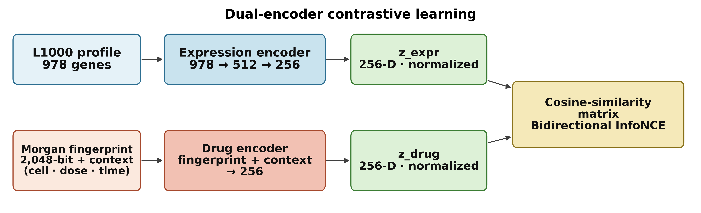
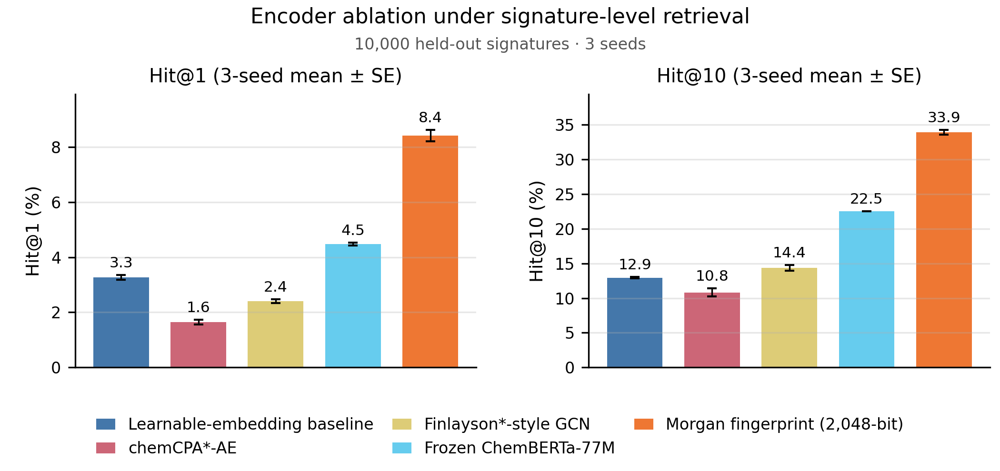
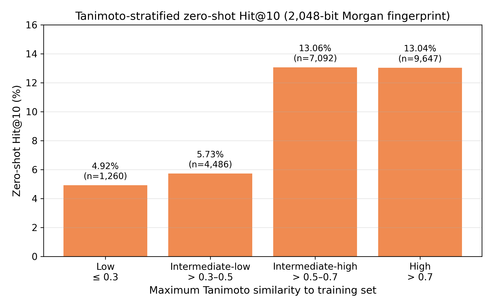

# Dual-Encoder Drug Repurposing

Code for *Integrating Chemical Structure and Transcriptional Responses via Dual-Encoder Contrastive Learning for Drug Repurposing* (Hyunseung Kong, Inyoung Kim, Byoung-Tak Zhang).

Connectivity mapping ranks compounds by comparing transcriptional signatures, but it does not use molecular structure. This work aligns the two: an expression encoder maps L1000 profiles (978 landmark genes) and a drug encoder maps a 2,048-bit Morgan fingerprint together with cell line, dose and time into a shared 256-dimensional space, trained with a bidirectional InfoNCE loss. The data are 109,721 L1000 signatures of 20,401 compounds. The trained model ranks reference compounds for an expression profile, or expression signatures for a compound under given conditions.



## Main results

On 10,000 held-out signatures, the Morgan fingerprint encoder places the matching drug-condition embedding first for 8.42% of queries and within the top 10 for 33.93% (mean of three training seeds; random expectation 0.01% and 0.10%). Under the same training setup it outperforms a learnable per-compound embedding (3.27% and 12.94%), frozen ChemBERTa-77M embeddings (4.48% and 22.54%), a Finlayson-style GCN and a chemCPA-style autoencoder, and it has 35% fewer trainable parameters than the learnable-embedding baseline.



Fingerprints also cover compounds never seen in training. When 20% of the unique canonical SMILES are held out, Hit@10 reaches 11.13% against a random expectation of 0.044%. Accuracy follows chemical similarity to the training set: 4.92% for test compounds with a maximum Tanimoto similarity of at most 0.3, and about 13% above 0.5.



Across 49,996 random compound pairs, the cosine similarity of learned drug embeddings correlates with Tanimoto similarity (Spearman ρ = 0.375, 95% CI 0.367-0.383), while random embeddings show no correlation ([Figure 5](figures/figure5_embedding_similarity.png)).

## Repository layout

```
src/        data loading, encoders, training and evaluation
scripts/    one script per experiment, plus figure and table generation
results/    result files behind every number in the paper
models/     embedding_model.pt, the checkpoint analysed in Figure 5
figures/    Figures 1-5 (PNG and PDF)
data/       input files from GEO GSE92742 (see data/README.md)
```

## Installation

Tested with Python 3.11 and PyTorch 2.5.1 (CUDA 12.1) on one NVIDIA RTX 4060 (8 GB).

```bash
python -m venv .venv
source .venv/bin/activate          # Windows: .venv\Scripts\activate
pip install torch==2.5.1 --index-url https://download.pytorch.org/whl/cu121
pip install -r requirements.txt
```

## Data

Download the GSE92742 files listed in [data/README.md](data/README.md) into `data/`, then extract the compound SMILES:

```bash
python scripts/extract_smiles.py
```

The first experiment reads the GCTX file (a few minutes) and writes `cache/l1000_basics.pkl` (about 630 MB); later runs reuse it. It contains 109,721 small-molecule signatures at 24 h for 20,401 compounds and 30 cell lines.

## Reproducing the paper

| Paper item | Command | Output |
|---|---|---|
| Table 1, Table 3, Figure 2, Supplementary Table S1 | `python scripts/chemberta_embeddings.py` then `python scripts/encoder_ablation.py` | `results/encoder_ablation.pkl` |
| Table 2, Figures 3 and 4, Supplementary Table S3 | `python scripts/zero_shot.py` | `results/zero_shot.pkl` |
| Supplementary Table S4 | `python scripts/zero_shot_multisplit.py` | `results/zero_shot_multisplit.pkl` |
| Section 3.3, Figure 5 | `python scripts/embedding_similarity.py` | `results/embedding_similarity.pkl` |
| Section 2.1, Supplementary Table S2 | `python scripts/chemical_space.py` | `results/chemical_space.pkl` |
| Model analysed in Figure 5 | `python scripts/train_embedding_model.py` | `models/embedding_model_retrained.pt` |
| Figures 1-5 | `python scripts/make_figures.py` | `figures/` |
| All tables | `python scripts/summarize_results.py` | printed to the console |

`make_figures.py` and `summarize_results.py` read only `results/`, so they run without the L1000 data. The experiment scripts overwrite the files in `results/`; `git checkout results/` restores the published versions.

Approximate run times on the GPU above: about 10 s per encoder and seed (30 s for the GCN), 10 minutes per split for the zero-shot evaluation (most of it spent on Tanimoto similarities), and 1 minute for the embedding-similarity analysis.

## Notes

- With a fixed seed, the Morgan, learnable-embedding, chemCPA-style and ChemBERTa encoders reproduce the reported values exactly on this hardware and software. The GCN uses non-deterministic CUDA scatter operations in PyTorch Geometric, so its values vary slightly between runs (Hit@1 2.33-2.38% for seed 42).
- `models/embedding_model.pt` was trained without a fixed seed. `scripts/train_embedding_model.py` trains a comparable model but not an identical one.
- The 75 compounds without a parseable SMILES receive an all-zero Morgan fingerprint and are excluded from the canonical-SMILES split.
- Dose bins use the leading number of `pert_idose`; the unit is not converted.
- In the zero-shot evaluation, the rank of a query is the number of candidates with a strictly higher similarity than its own drug-condition embedding.

## Citation

Kong H, Kim I, Zhang B-T. Integrating Chemical Structure and Transcriptional Responses via Dual-Encoder Contrastive Learning for Drug Repurposing. Accepted for publication; the full reference will be added when the article is online.

## License

MIT (see [LICENSE](LICENSE)).
